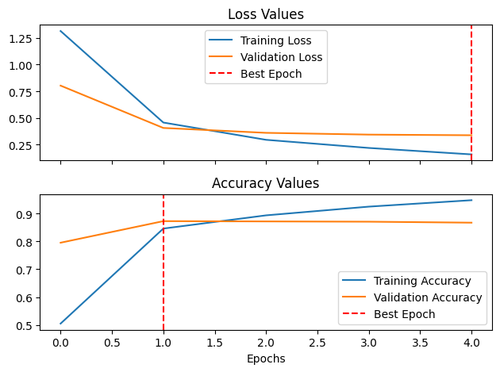
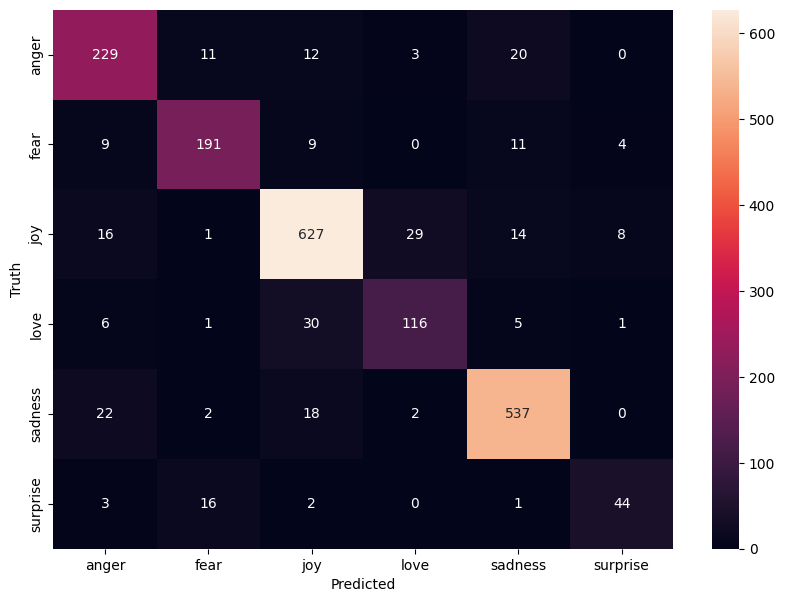

# Emotion Detection
### This project leverages Natural Language Processing (NLP) techniques to classify emotions from given sentences, aiming to accurately identify and categorize the underlying emotional states conveyed in the text.
### Rose Tovar
### [rvtovar25@gmail.com](mailto:rvtovar25@gmail.com)

### Objective
The primary objective of this project is to develop and refine a Natural Language Processing (NLP) system capable of accurately classifying emotions from textual data. By utilizing advanced machine learning algorithms and neural network architectures, such as Conv1D, the project aims to discern and categorize a range of emotional states expressed in sentences. This involves not only the identification of clear-cut emotions like joy, sadness, or anger but also the more subtle and complex interplays of these emotions. The system's accuracy in emotion recognition is paramount, as it seeks to closely mimic human-level understanding and interpretation of emotional nuances in language. This endeavor not only pushes the boundaries of NLP and AI in emotion recognition but also has potential applications in areas such as sentiment analysis, mental health assessment, customer service, and interactive AI systems, where understanding human emotions plays a crucial role.
### Data
The dataset originated from kaggle
[Dataset Link](https://www.kaggle.com/datasets/praveengovi/emotions-dataset-for-nlp)

The data contained a sentence with an underlying emotion attached the end seperated by a semicolon

### Model:
For this initiative, we ultimately selected the Simple Conv1D model due to its superior accuracy, which was identified as the most critical metric for our goals. Our primary interest lay in precise labeling, with less emphasis on the distinction between false negatives and positives.
### Insights
#### Accuracy and Loss History

 The graph presents the training and validation loss and accuracy values over the course of four epochs during a machine learning model training process. The training loss starts higher but decreases rapidly, indicating that the model is effectively learning from the training dataset. The validation loss also decreases, but at a slower rate, suggesting that while the model is generalizing to unseen data, there is a gap between the training and validation loss, which could be a sign of overfitting as the epochs increase. The best epoch, marked by the red dashed line, appears to be just before the third epoch, where the validation loss is at its lowest, suggesting this is the optimal stopping point before the model begins to overfit.

In terms of accuracy, the training accuracy increases steadily, which is expected as the model becomes better at predicting the training data. The validation accuracy also increases, almost matching the training accuracy, which is a positive sign of the model's generalization. However, similarly to the loss, the best epoch for accuracy is indicated at the same point just before the third epoch, where the validation accuracy is highest. Beyond this point, the training accuracy continues to improve while the validation accuracy plateaus, reinforcing the indication of overfitting past this epoch. Therefore, the model's performance is optimal at the indicated best epoch for both loss and accuracy.

#### Confusion Matrix
The confusion matrix depicted in the image provides a detailed look at the performance of an emotion classification model. It's evident that the model performs best at classifying 'joy,' with a high number of true positives (627), indicating a strong ability to recognize this emotion accurately. 'Sadness' and 'anger' are also well-identified, with 537 and 229 true positives, respectively. However, there are noticeable confusions, particularly between 'joy' and 'love', which could be due to the closeness of these emotions in expression. 'Fear' seems to be the most challenging for the model to identify correctly, with a relatively lower true positive count (191) and more misclassifications as 'anger' and 'surprise'. This confusion matrix suggests that while the model is effective in differentiating certain emotions, it struggles with others that may have similar linguistic expressions or contextual overlap, a common challenge in NLP emotion classification tasks.
### Final Remarks
In conclusion, our project's journey with the Simple Conv1D model has been a testament to the power of targeted model selection based on project-specific metrics. By prioritizing accuracy above other metrics, we honed in on the model's robust ability to label emotions correctly from textual data, a crucial requirement for our objectives. While acknowledging the challenges of distinguishing between closely related emotions—a task that often perplexes even human discernment

